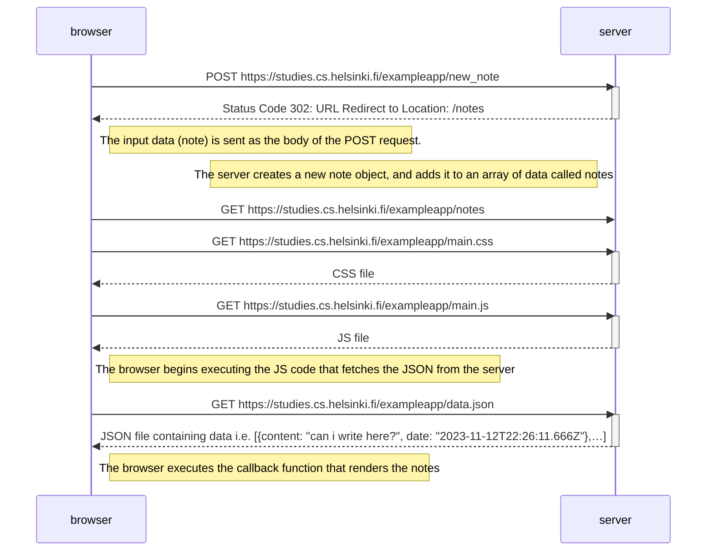

```mermaid
sequenceDiagram
    participant browser
    participant server

    browser->>server: POST https://studies.cs.helsinki.fi/exampleapp/new_note
    activate server
    server-->>browser: Status Code 302: URL Redirect to Location: /notes
    deactivate server

    Note right of browser: The input data (note) is sent as the body of the POST request.
    Note left of server: The server creates a new note object, and adds it to an array of data called notes

    browser->>server: GET https://studies.cs.helsinki.fi/exampleapp/notes

    browser->>server: GET https://studies.cs.helsinki.fi/exampleapp/main.css
    activate server
    server-->>browser: CSS file
    deactivate server

    browser->>server: GET https://studies.cs.helsinki.fi/exampleapp/main.js
    activate server
    server-->>browser: JS file
    deactivate server

    Note right of browser: The browser begins executing the JS code that fetches the JSON from the server

    browser->>server: GET https://studies.cs.helsinki.fi/exampleapp/data.json
    activate server
    server-->>browser: JSON file containing data i.e. [{content: "can i write here?", date: "2023-11-12T22:26:11.666Z"},…]
    deactivate server

    Note right of browser: The browser executes the callback function that renders the notes
```