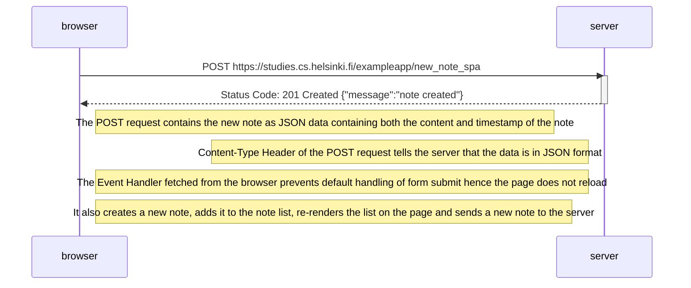

```mermaid
sequenceDiagram
    participant browser
    participant server

    browser->>server: POST https://studies.cs.helsinki.fi/exampleapp/new_note_spa
    activate server
    server-->>browser: Status Code: 201 Created {"message":"note created"}
    deactivate server
    
    Note right of browser: The POST request contains the new note as JSON data containing both the content and timestamp of the note
    Note left of server: Content-Type Header of the POST request tells the server that the data is in JSON format
    Note right of browser: The Event Handler fetched from the browser prevents default handling of form submit hence the page does not reload
    Note right of browser: It also creates a new note, adds it to the note list, re-renders the list on the page and sends a new note to the server

```